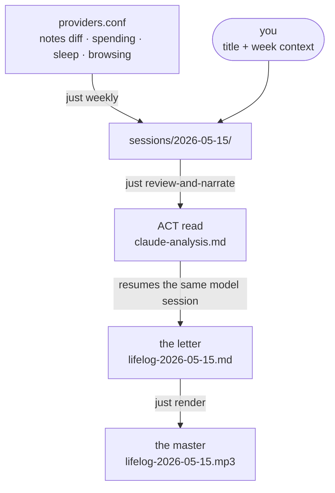
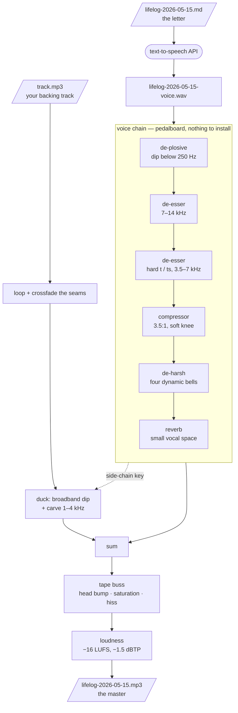

# Petrograph

Markdown in, a letter you can listen to out. Petrograph assembles a week of Obsidian notes,
spending, sleep and browsing into one file, asks a model to read it and write back a
compaction letter, and narrates that letter over a backing track.

Obsidian is volcanic glass; microlites are the tiny crystals whose arrangement records the
molten flow; a petrograph studies their orientation. This repo keeps that record as markdown,
not as artifacts on somebody's website.

Accompanying blog post: https://jaan.io/lifelogging-with-large-language-models

## The process



Three steps, and you type in only one of them.

1. **Assemble.** `just weekly` runs every provider in `providers.conf` and wires what they
   write into a fresh session.
2. **Write the week down.** Open `sessions/<date>/edit-me.md` and fill in the title and the
   freeform week-context paragraph — mood, sleep, plans, whatever the notes don't show.
   Everything else already has a default.
3. **Run it.** `just review-and-narrate sessions/<date>` reads the week, writes the letter,
   and narrates it. Four stages, about four minutes, no further input.

```sh
just weekly
$EDITOR sessions/2026-05-15/edit-me.md
just review-and-narrate sessions/2026-05-15
```

## A session is a directory

One run of the pipeline writes one folder, so `ls` prints the pipeline:

```
sessions/2026-05-15/
    edit-me.md                     the one file you write
    microlite.md                   the week's Obsidian history
    finances-2026-05-15.md         what the providers wrote
    oura-2026-05-15.md
    claude-analysis.md             the ACT read
    lifelog-2026-05-15.md          the letter — a stub until Claude or you fill it
    bundle.md                      --dry-run only: the assembled prompt

    lifelog-2026-05-15.mp3         the master — voice + ducked track. the one you play.
    lifelog-2026-05-15-voice.wav   the narration alone, 24-bit
    lifelog-2026-05-15-stem.wav    the coloured voice, 24-bit, for re-mixing
```

Every file says what it is, and the folder name says which week. The letter repeats the date
because its audio leaves the folder — onto a phone, into a car — where the filename is the
only context there is.

Commands take the directory; a session knows where its own stages live, so one you renamed,
moved or restored from a backup still works. `just render` is the exception: it takes the
markdown file, because the file it narrates is a choice.

`sessions/` and `share/` are written under `$PETROGRAPH_OUT` (or `--out-root`), which defaults
to this repo and is gitignored here. Point it somewhere backed up: the diffs are a unique
record, and Obsidian's File Recovery prunes them.

**Where the week goes.** A session holds the most private document here — a letter about
therapy, sleep, money and who you saw. The read and the letter go to a model, which is the
point of them. The narration is a separate choice: the hosted engine posts the finished letter
to an API, and `chatterbox` synthesises it on this machine and sends nothing.

```sh
just review-and-narrate <session> --tts-engine chatterbox   # this run
engine: chatterbox                                          # this session, in its front-matter
PETROGRAPH_TTS_ENGINE=chatterbox                            # this machine, in .env
```

Most specific wins. Unset everywhere, the hosted engine narrates. Everything downstream is
identical either way.

## The audio

`just render` takes the letter and a backing track and returns a master. The voice chain runs
on [pedalboard](https://github.com/spotify/pedalboard) and its open-source built-ins, so a
render works on a machine with nothing installed.



The duck is frequency-selective: one envelope, keyed off the processed voice, drives a gentle
broadband dip (8 dB) plus a deeper cut confined to the speech band (9 dB over 1–4 kHz). The
bed keeps its body and air and still sits out of the way of the words. The tape buss then
glues voice and music together in one saturation pass, and a two-pass ffmpeg `loudnorm` sets
the delivery level. ffmpeg does only the final encode.

Two engines colour the voice; everything else — the loop, the duck, the sum, the fades, the
delivery loudness — is shared, so a fix to the ducker lands on both.

| `--engine` | What it is | Needs | Speed |
| --- | --- | --- | --- |
| `oss` (default) | `mix_chain_oss.py` — the chain above | nothing installed | well under a second |
| `vst` | `mix_chain_vst.py` — the six commercial plug-ins the OSS chain was derived from | licences under `/Library/Audio/Plug-Ins/VST3` | far slower |

The `vst` engine is the original and the reference where the two disagree: RX 12 De-plosive →
Pro-DS → a second Pro-DS → Pro-C 3 → soothe2 → Pro-R 2, then Satin over the summed mix. Every
constant in `oss` is derived from the preset the plug-in it stands in for was running. Two
stages are approximations and say so where they are defined: the de-harsh (four fixed bells
against soothe's hundred tracking ones) and the reverb (Freeverb has no early reflections, so
Pro-R's *Distance* and *Character* are dropped rather than faked).

The choice propagates through `just mix <voice> <track> "" vst`, `just render <md> <track> 1
<voice-id> vst`, `eleven_tts.py --mix-engine vst`, or a `music-engine: vst` line in a session's
front-matter. Stage flags are generic: `--no-deharsh`, `--no-tape`, `--tape-drive`,
`--tape-hiss` mean the right thing on either engine.

Each engine checks itself before every render, in the way that engine can be checked. The
`vst` one reads its parameters back, because pedalboard cannot load `.ffp` / `.xml` / `.h2p`
preset files and every factory preset is reconstructed by writing raw parameters. The `oss`
one has nothing to interrogate, so 20 assertions measure the DSP itself — de-esser reduction,
soft-knee gain, reverb RT60, tape THD, hiss level — in about 0.2 s. `--no-self-test` skips it.

**Credits.** Every synthesised chunk is cached under `share/.tts-cache`, keyed by its text,
voice, model and format, and written the instant it comes back. A render that dies partway has
banked what it paid for, and running the same command again buys only what is missing. Price
one first with `./tools/eleven_tts.py <letter> --chunk 300 --dry-run`.

## Tools

| Tool | What it does |
| --- | --- |
| `weekly_review.py` | The orchestrator: one filled-in input file in, a diff, an ACT read, a letter and its narration out. It runs the other tools as subprocesses rather than reimplementing them. |
| `weekly_context.py` | The front half: runs the commands in `providers.conf` and wires what they write into a session. It never learns what a provider produced — a ledger and a sleep report are both just markdown. |
| `microlite_hunks.py` | The week's Obsidian history as diffs, from File Recovery snapshots. The reader lives in [obsidian-microlite](https://github.com/altosaar/obsidian-microlite), pinned as a submodule, so the plugin button and the pipeline give the same review. |
| `oura_metrics.ts` | The week's sleep and physiology against the three weeks before it, through the [obsidian-oura-metrics](https://github.com/altosaar/obsidian-oura-metrics) plugin's own code — so the note in the bundle is the note you reviewed in Obsidian. |
| `eleven_tts.py` | Narrate a letter through the hosted TTS API (`ELEVENLABS_API_KEY`). Long letters generate in short chunks stitched with ffmpeg, which fixes the engine's quieter-over-time drift. Pauses follow the document's shape: a longer beat after a heading than after a sentence. |
| `chatterbox_tts.py` | The same job on this machine, on Resemble AI's [Chatterbox](https://github.com/resemble-ai/chatterbox), so the letter is read aloud without being posted anywhere. Pauses are real silence rather than pause hyphens. It is a zero-shot cloner: any voice but its own is a 10–20 second reference clip you supply. Everything either side of synthesis is shared with `eleven_tts.py` in `_speech.py`. |
| `compact_tts.py` | Narration through Cartesia, the third engine. |
| `mix_music.py` | Lay a narration over a looping backing track, ducked out of its own way — the chain above. |
| `vault_corpus.py` | Assemble a long window (default 12 months) of vault text for extraction. It tags every block with how it was obtained — `git`, `recovery`, `entry`, `file` — so a reader can weight or filter them, rather than pretending the history is exact. |
| `extract_names.py` | Named-entity extraction over that corpus via Haiku 4.5, with structured outputs, a bounded thread pool and a per-chunk cache. Every name is checked against the chunk it came from and dropped if it isn't there. A 12-month run cost $2.61. |
| `names_html.py` | That JSON as one self-contained page. Click a name, get every chunk it appears in, with the note, the date and the provenance badge. |
| `vault_snapshot.sh` | rsync the vault's markdown into a local git mirror and commit, so long-window diffs stop being a reconstruction. |
| `extract_contacts.py` + `contacts_html.py` | Who you actually message, from Messages and WhatsApp. No API calls; every database is opened read-only through the immutable URI. |
| `contacts_diff.py` | What changed between two contact snapshots, compared as messages per month so windows of different lengths still line up. |
| `browsing_history.py` | The week in the browser as a shape rather than a log: one row per site per hour, URLs left out. A week comes to ~52k characters against ~380k enumerated. |
| `normalize-checkboxes.sh` | Rewrite `- [ ]` checkboxes in `~/notes` so Obsidian stops detecting them as tasks. |

Each tool's `--help` and `tools/README.md` carry the rest.

## What lives where

| Path | Lifecycle | Notes |
| --- | --- | --- |
| `tools/` | code, publishable | Version-controlled here; published to a public gist on demand. |
| `prompts/` | reusable assets | `act-analysis.md` and `narrative-compaction.md` ask the two questions; `synthetic-style-guide.md` carries the register and is appended after the ask, so `--prompt` swaps the question without silently dropping the voice. |
| `sessions/<date>/` | private, gitignored | One session, one directory. Only the `TEMPLATE*.md` files are tracked: they are the form, not the content. |
| `providers.conf` | private config | The commands that assemble a week. Gitignored — it holds paths to private repositories. Start from `providers.example.conf`. |
| `share/` | derived, gitignored | The TTS cache and the sentinel `just mix` is gated on. Never committed. |
| `corpus/`, `messages/`, `browsing/` | derived, gitignored | Raw private note text, other people's words, and your browsing. Regenerable end to end. **Never committed, never published.** |
| `synthetic/` | generated, **committed** | A second vault with nobody in it — four weeks in the same formats as the real ones, so the charts can be shown to somebody. Clone the repo and the connectome opens with no API key and no vault. See `synthetic/README.md`. |
| `~/.local/share/petrograph/vault-history/` | private mirror | A git mirror of the vault's markdown, one commit per `just vault-snapshot`. Outside this repo, never pushed. |

## The providers

A provider is a command that writes one markdown file. That is the whole contract, and it is
what keeps the private material in the private repositories, with their own credentials.

| Provider | Writes | Role |
| --- | --- | --- |
| `microlite` | the week's Obsidian diff | `diff` |
| `finances` | the week's spending, as Beancount stubs | attachment |
| `oura` | sleep and physiology, against the 3 weeks before | attachment |
| `browsing` | where the week went online | attachment |

```sh
just weekly --only microlite               # one provider; merges into the session
just weekly --only finances,oura           # several
just weekly --skip browsing                # everything but one
just weekly --days 14
just weekly --dry-run                      # print the commands, run nothing
```

A provider that fails costs you its attachment, not the run: the others still go and the
failure is listed at the end. A provider that *succeeds* and returns nothing is called out
just as loudly, because it is the harder failure to see — an unsynced ledger, a ring left on
the charger, each writes a correct document saying nothing happened. petrograph cannot tell a
quiet week from a stale source, so it quotes the sentence the provider gave it. Make that
sentence say *why* it is empty:

```text
STALE LEDGER — no data after 2026-04-26, and this window opens 2026-04-29, 3 days
later. Run `just pull` to sync and recompile.
```

Four more flags decide the session rather than the providers, and are written into its
front-matter so they hold for every later command on that week:

```sh
just weekly --llm opencode                 # opencode writes the read + letter
just weekly --tts-engine chatterbox        # narrated on this machine
just weekly --music ~/beds/rain.flac       # the letter is mixed over a bed
just weekly --blank-context                # nothing left to fill in
```

`--blank-context` writes a stand-in title and a week context saying plainly that none was
written, so the read works from the diff and does not invent a mood to explain it. Straight
through:

```sh
just weekly --blank-context && just review-and-narrate sessions/$(date +%F)
```

## The run

| Stage | What runs | Lands in |
| --- | --- | --- |
| `1/4 hunks` | reuses `microlite.md` if a provider built it, else `microlite_hunks.py` | `microlite.md` |
| `2/4 act read` | `act-analysis.md` + the style guide + diff + attachments + context, to a fresh session | `claude-analysis.md` |
| `3/4 letter` | `narrative-compaction.md`, **resuming that session** | `lifelog-<date>.md` |
| `4/4 narrate` | the TTS engine `engine:` names | `lifelog-<date>-voice.wav`, and the master beside it when `music:` is set |

Stage 3 resumes rather than restarts, because that is the property the old copy-paste flow had
and the one worth keeping: the letter is written with the diff and the analysis still in
context, not from a summary of them.

Every file is created with its front-matter filled in — model, session id, voice, sources,
prompts, and cross-links between the read and the letter. That front-matter *is* the
context-engineering log, and the TTS tools strip it before narrating, so the same file is both
the durable record and the input.

The two model calls are the expensive part, so a failure after them shouldn't pay for them
twice:

```sh
just review-and-narrate <session> --dry-run          # assemble and price the bundle, call nothing
just review-and-narrate <session> --resume           # redo only the letter + narration
just review-and-narrate <session> --skip-narration   # stop after the letter
```

`--resume` picks the session back up from the id in `claude-analysis.md`, so it needs no path.

## The manual path

The unattended run is optional. If you would rather steer the conversation yourself, the
pipeline splits cleanly in half at the bundle.

```sh
just weekly
$EDITOR sessions/2026-05-15/edit-me.md
just review-and-narrate sessions/2026-05-15 --dry-run
```

`--dry-run` makes no API calls. It writes `bundle.md` into the session — the prompt, your week
context, every attachment under its own heading, and the diff, byte for byte what the
unattended run would have sent — and prints a character and token count per part. Paste that
one file rather than the four separately.

Read the analysis it comes back with, ask for the compaction letter in the same conversation,
then paste the letter into `sessions/2026-05-15/lifelog-2026-05-15.md`. Paste it raw: the
narrator strips front-matter, bold and italic markers and rules, and gives headings and
bullets a full stop so the voice lands instead of running on.

```sh
just render sessions/2026-05-15/lifelog-2026-05-15.md 'track.flac'
just render <letter> 'one.flac,two.flac'             # in order, then loops
just render <letter> 'track.flac' 2                  # more breathing room
just render <letter> 'track.flac' 1 "" vst           # the licensed plug-ins
just render <letter> 'track.flac' 1 "" oss chatterbox  # narrated locally
```

The backing track is required and positional; comma-separate for several and quote the list.
The trailing arguments are, in order: sentence pause (`0` off, `1` default, `2` more), voice id,
mixer engine, and narrator. `just render` refuses to spend credits while the letter is still
the stub.

## opencode instead of Claude

Stages 2 and 3 go through the `claude` CLI by default. `--llm opencode` sends the same two
prompts through [opencode](https://opencode.ai), so whichever provider and model you are signed
in to there writes the read and the letter:

```sh
just review-and-narrate sessions/2026-05-15 --llm opencode
```

Nothing else moves: same bundle, same prompts, same resumption, same archived files. Both
documents gain an `llm:` line, so a `--resume` follows the run it is resuming rather than
today's default. A session can ask for it in its own front-matter:

```yaml
llm: opencode
model: anthropic/claude-opus-4-5   # `opencode models` lists what you are signed in to
effort: high                       # becomes `--variant`
```

`model:` belongs to whichever CLI is running — a Claude alias under `claude`, a
`provider/model` pair under opencode. An alias left in place when you flip the key is refused
rather than sent.

For a model opencode ships no provider for, declare one at the repo root:

```sh
cp opencode.example.json opencode.json      # then edit the host, the key, the model
```

Give it a real `limit.context`: a week's bundle is the whole window's diff and every
attachment, and a model that truncates it will write the letter from whatever survived.

Under opencode the read also gets two reference sections after the diff — `prompts/metaphors.md`,
and `tools/example.md` if it exists: one read kept as the standard, gitignored rather than shipped
because a week's read is a week of a person, so put your own there. Together they cost about
eight thousand tokens and roughly double the bundle; the exemplar is skipped when absent. Neither reaches the Claude path;
`--dry-run` on both writes the two bundles, so you can diff them.

`--prompt FILE` overrides the ask on either backend. It is a flag rather than a front-matter
key on purpose: `llm:` and `model:` are recorded so a session re-runs the way it ran, while
this one asks a question *about* a session — what would this week look like asked the other
way — and answering it should not edit the session.

## Name extraction

A wider read than the weekly one: 12 months of vault text rather than a week's diff.

```sh
just names-cost            # what will this cost? (no API calls)
just names-render          # corpus → Haiku extraction → browsable page
```

Clicking a name on the page shows every chunk it appeared in, with the note, the date and the
provenance badge — so a mention from a real diff is distinguishable at a glance from one
reconstructed off an mtime. The chunk cache means a re-run after another month of notes costs
cents rather than the full $2.61.

The first pass returns 7,188 distinct names, which includes every author, product and place
the notes mention once. `--min-mentions 2` cuts that tail; the kind filter isolates people
from organizations and places.

## Commands

```sh
just weekly                                        # providers → session
just review-and-narrate sessions/2026-05-15        # END TO END: → letter → mp3
just render <letter> track.flac                    # END TO END: → narration → master
just remix <letter> track.flac vst                 # the master again from the narration on disk — no API
just mix narration.mp3 track.flac                  # mix an existing narration
just estimate <letter>                             # how long, and what it would cost
just eleven <letter> track.flac                    # narrate + master
just chatterbox <letter> track.flac                # the same, locally
just voice-sample old-narration.mp3                # cut a reference clip for chatterbox
just hunks /tmp/week.md                            # the diff alone, wired into nothing
just view                                          # the week's hunks in hunk (TUI)
just synth                                         # END TO END: a synthetic vault, and its pages
just corpus                                        # 12-month NER corpus
just vault-snapshot                                # commit the vault to the local git mirror
just names-render                                  # END TO END: corpus → names → page
just contacts-render                               # END TO END: databases → contacts → page
just contacts-snapshot                             # dated baseline
just contacts-diff                                 # what changed between the two newest
just summarize-browsing                            # the week's browsing → browsing/*.md
just normalize --apply                             # normalize checkboxes in ~/notes
just publish-gist                                  # push tools to the public gist
just smoke                                         # every stage end to end, billing nothing
just smoke quick                                   # …without the mix (~10s instead of ~105s)
```

Most recipes take the extra arguments their sections above describe. `just --list` prints them
all.
